# 🌱 HabitFlow — Architecture Guide (start here)

> **What this document is:** a beginner-friendly tour of the _whole_ project — every app, how a
> request travels, how login/authentication really works, how data is stored and cached, how the
> mobile app works offline, and how it all gets deployed.
>
> **How to read it:** top to bottom the first time. After that, jump straight to a section from the
> table of contents. Every diagram is followed by a plain-English explanation, and file paths are
> clickable.
>
> **You do not need to know NestJS, Prisma or React Native to follow along.** Terms are explained
> the first time they appear.

---

## Table of contents

1. [What the app does](#1-what-the-app-does)
2. [The 10,000-foot view](#2-the-10000-foot-view)
3. [Repository layout (tree)](#3-repository-layout-tree)
4. [The vocabulary you need](#4-the-vocabulary-you-need)
5. [The backend: how one request travels](#5-the-backend-how-one-request-travels)
6. [🔐 Authentication — the full story](#6--authentication--the-full-story)
    - [6.1 The two tokens](#61-the-two-tokens)
    - [6.2 Email + password signup / login](#62-email--password-signup--login)
    - [6.3 Using the token on every request](#63-using-the-token-on-every-request)
    - [6.4 Silent refresh (why you never get logged out)](#64-silent-refresh-why-you-never-get-logged-out)
    - [6.5 Logout & instant revocation (`tokenVersion`)](#65-logout--instant-revocation-tokenversion)
    - [6.6 Google sign-in on the web](#66-google-sign-in-on-the-web)
    - [6.7 Google sign-in on mobile (deep link + one-time code)](#67-google-sign-in-on-mobile-deep-link--one-time-code)
    - [6.8 Where tokens are stored, and why](#68-where-tokens-are-stored-and-why)
7. [🚦 Authorization — the guard stack as a decision tree](#7--authorization--the-guard-stack-as-a-decision-tree)
8. [The data model](#8-the-data-model)
9. [Caching with Redis](#9-caching-with-redis)
10. [The web app](#10-the-web-app)
11. [The mobile app (offline-first)](#11-the-mobile-app-offline-first)
12. [Reminders & forced updates](#12-reminders--forced-updates)
13. [Error handling](#13-error-handling)
14. [Complete API reference](#14-complete-api-reference)
15. [Running it locally](#15-running-it-locally)
16. [Deployment & CI](#16-deployment--ci)
17. [Cheat sheet: "where do I change X?"](#17-cheat-sheet-where-do-i-change-x)
18. [Other docs in this folder](#18-other-docs-in-this-folder)

---

## 1. What the app does

HabitFlow is a habit tracker with a twist: **every habit is a plant**. Keep the streak alive and it
grows seed → sprout → flower. Miss days and it wilts.

A user can:

| Feature              | What it means                                                                                           |
| -------------------- | ------------------------------------------------------------------------------------------------------- |
| **Habits**           | Create habits with a name, a monthly goal, an icon, a time-of-day, and the weekdays it's due on.        |
| **Daily check-off**  | Tick a habit for a given calendar day. One tick = one `HabitLog` row.                                   |
| **Calendar & stats** | Streaks, completion rates, heatmaps, charts per month.                                                  |
| **Day notes**        | One free-text reflection per calendar day ("why did I miss this?").                                     |
| **Focus sessions**   | A built-in timer; finished sessions are recorded in minutes with optional ambient sound.                |
| **Archive**          | Retire a habit without deleting its history.                                                            |
| **Reminders**        | Local push notifications on mobile, with _Done_ and _Snooze_ buttons.                                   |
| **Works offline**    | The mobile app is fully usable with no network; writes sync later.                                      |
| **Admin dashboard**  | Admins can list users, see their progress, suspend accounts, record payments, and publish app releases. |

---

## 2. The 10,000-foot view

One backend, two frontends, one database. Everything talks HTTP + JSON.

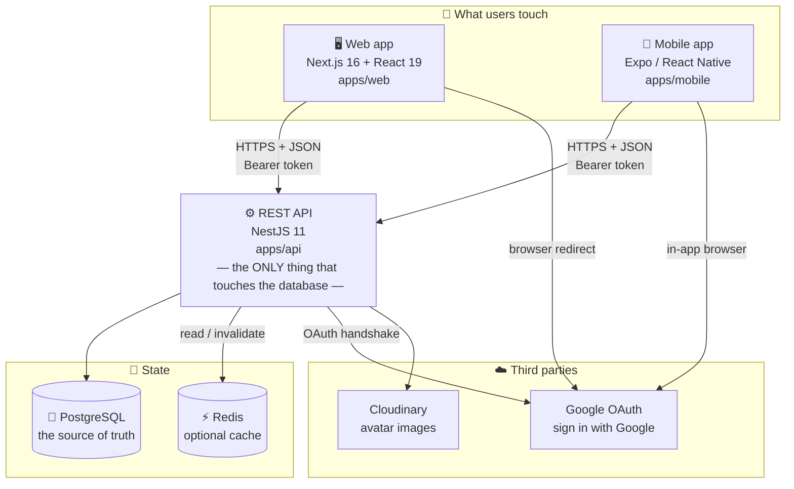

**Read that as three rules:**

1. **The clients never touch the database.** They only call the API. That is why business rules
   (who may see what, what counts as a valid habit) live in exactly one place.
2. **PostgreSQL is the truth.** Redis is a _cache_ — a fast copy of answers we already computed. If
   Redis disappears, the app keeps working, just slower. Nothing is ever _only_ in Redis.
3. **The web and mobile apps are peers.** Neither is "the real one"; they call the same endpoints.

---

## 3. Repository layout (tree)

This is a **monorepo**: several apps in one Git repository, built together by
[Turborepo](https://turborepo.dev) and installed by [pnpm](https://pnpm.io).

```
Habit-Tracker/
│
├── apps/
│   ├── api/                     ⚙️  NestJS backend — the brain
│   │   ├── prisma/
│   │   │   ├── schema.prisma        the database shape, written once
│   │   │   └── migrations/          11 timestamped SQL steps, applied in order
│   │   ├── generated/prisma/        auto-generated DB client (gitignored)
│   │   ├── scripts/
│   │   │   └── promote-admin.ts     make a user an ADMIN from your laptop
│   │   └── src/
│   │       ├── main.ts              boot: CORS, validation, error filter, listen
│   │       ├── app.module.ts        wiring: every module + the 5 global guards
│   │       │
│   │       ├── auth/            🔐  signup, login, Google, JWT, guards
│   │       ├── habits/              habits + daily logs + templates
│   │       ├── notes/               one note per calendar day
│   │       ├── focus/               focus-timer sessions and stats
│   │       ├── users/               /users/me, profile, avatar upload
│   │       ├── admin/               admin-only dashboard endpoints
│   │       ├── releases/            "is there a newer app version?"
│   │       │
│   │       ├── prisma/              database connection service
│   │       ├── redis/               cache client + cache helpers + key names
│   │       └── common/              cross-cutting: error filter, CORS list,
│   │                                client guard, keep-alive, pagination
│   │
│   ├── web/                     🖥️  Next.js app (App Router)
│   │   ├── app/                     one folder per URL: /login, /dashboard, /admin …
│   │   ├── components/              charts, plants, habit grid, modals
│   │   ├── provider/                React Query + theme providers
│   │   └── src/lib/api.ts       ⭐  THE single API client (tokens + refresh live here)
│   │
│   └── mobile/                  📱  Expo app (standalone — its own node_modules)
│       └── src/
│           ├── app/                 expo-router screens: (tabs)/, login, add, focus …
│           ├── api/             ⭐  client.ts (fetch + refresh), AuthProvider, hooks
│           ├── offline/         ⭐  outbox.ts + sync.ts — the offline engine
│           ├── notifications/       reminder scheduling
│           ├── lib/                 storage (SecureStore), date & streak math
│           └── theme/               design tokens, light/dark
│
├── packages/                        shared, versioned as workspace:* deps
│   ├── ui/                          a few shared React components
│   ├── eslint-config/               one lint setup for everyone
│   └── typescript-config/           one tsconfig preset for everyone
│
├── docs/                        📖  you are here
├── .github/workflows/               CI, DB migration, keep-alive robots
├── render.yaml                      how the API is deployed to Render
├── turbo.json                       task graph: build / lint / dev / check-types
└── pnpm-workspace.yaml              which folders are workspace packages
```

> **Why is `apps/mobile` excluded from the pnpm workspace?** See the comment in
> [pnpm-workspace.yaml](../pnpm-workspace.yaml): React Native's bundler (Metro) and pnpm's symlinked
> `node_modules` fight each other. So mobile installs with plain `npm` and keeps its own lockfile.

---

## 4. The vocabulary you need

Skim this once; it makes every later section obvious.

| Term                  | In one sentence                                                                                |
| --------------------- | ---------------------------------------------------------------------------------------------- |
| **Monorepo**          | Many apps in one repository so they can share code and ship together.                          |
| **REST API**          | A set of URLs you call with HTTP verbs (`GET`, `POST`, …) that return JSON.                    |
| **NestJS Module**     | A folder-sized feature box (`habits/`, `auth/`) holding its controller + service.              |
| **Controller**        | Maps a URL to a function. Does almost no thinking — just validates and delegates.              |
| **Service**           | Where the actual logic lives (talk to the DB, apply rules, cache).                             |
| **DTO**               | _Data Transfer Object_ — a class describing an allowed request body, with validation rules.    |
| **Guard**             | A yes/no gatekeeper that runs **before** the controller. Five of them run on every request.    |
| **Decorator**         | The `@Something()` sticker above a class or method that turns behaviour on/off.                |
| **Prisma**            | The library that turns `schema.prisma` into type-safe database calls.                          |
| **Migration**         | A saved SQL file that moves the database from one shape to the next.                           |
| **JWT**               | _JSON Web Token_ — a signed string that proves "I am user X" without a server-side session.    |
| **Bearer token**      | How a JWT rides along: the header `Authorization: Bearer <token>`.                             |
| **TanStack Query**    | The client-side library that fetches, caches and refetches server data.                        |
| **Optimistic update** | Show the result instantly, send the request in the background, fix it if the server disagrees. |
| **Outbox**            | A durable to-do list of writes the mobile app owes the server.                                 |

---

## 5. The backend: how one request travels

Take the single most common request in the app — ticking off a habit — and follow it all the way
down and back.

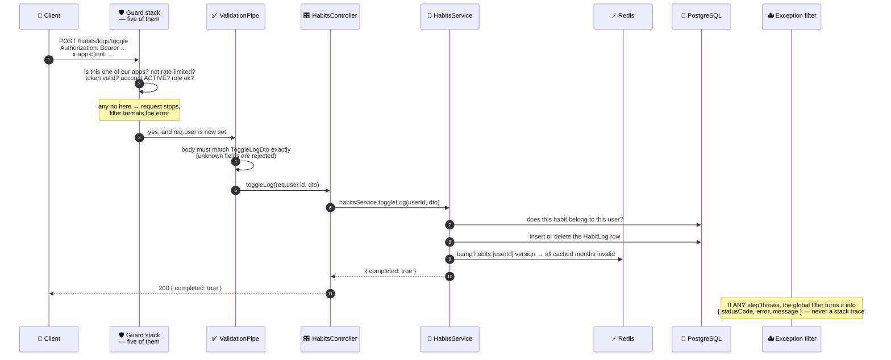

### The five layers, in words

| Layer             | File                                           | Job                                                                                                                                                                     |
| ----------------- | ---------------------------------------------- | ----------------------------------------------------------------------------------------------------------------------------------------------------------------------- |
| **1. Bootstrap**  | [main.ts](../apps/api/src/main.ts)             | Trust the proxy, enable CORS for known origins, install the validation pipe and the global error filter, listen on `PORT`.                                              |
| **2. Guards**     | [app.module.ts](../apps/api/src/app.module.ts) | Five gatekeepers, registered globally so _nothing is public by accident_. Detailed in [§7](#7--authorization--the-guard-stack-as-a-decision-tree).                      |
| **3. Validation** | `*/dto/*.ts`                                   | `whitelist: true` strips unknown fields, `forbidNonWhitelisted: true` rejects them outright, `transform: true` coerces types. A malformed body never reaches your code. |
| **4. Controller** | `*/*.controller.ts`                            | URL → method. Reads `req.user.id` (put there by the JWT guard) and passes it down. **Never trusts a user id from the request body.**                                    |
| **5. Service**    | `*/*.service.ts`                               | Ownership checks, database work, cache reads and invalidation.                                                                                                          |

> 🔑 **The security habit that matters most:** every service method takes `userId` as its first
> argument and filters on it — e.g. `where: { id: habitId, userId }`. That is why user A can never
> read or edit user B's habit, even by guessing an id.

---

## 6. 🔐 Authentication — the full story

Authentication answers **"who are you?"**. Authorization ([§7](#7--authorization--the-guard-stack-as-a-decision-tree))
answers **"are you allowed?"**. This section is only the first question.

HabitFlow uses **stateless JWT authentication with refresh tokens**. Stateless means the server
keeps no session table: the token itself carries the identity, and the server only checks the
signature. Files involved:

| File                                                                                                                                                                          | Role                                             |
| ----------------------------------------------------------------------------------------------------------------------------------------------------------------------------- | ------------------------------------------------ |
| [auth.controller.ts](../apps/api/src/auth/auth.controller.ts)                                                                                                                 | The 7 auth URLs.                                 |
| [auth.service.ts](../apps/api/src/auth/auth.service.ts)                                                                                                                       | Signing, verifying, hashing, revoking.           |
| [jwt.strategy.ts](../apps/api/src/auth/jwt.strategy.ts)                                                                                                                       | Turns a token into `req.user` on every request.  |
| [jwt-auth.guard.ts](../apps/api/src/auth/jwt-auth.guard.ts)                                                                                                                   | Demands a token unless the route is `@Public()`. |
| [google.strategy.ts](../apps/api/src/auth/google.strategy.ts) · [google-oauth.guard.ts](../apps/api/src/auth/google-oauth.guard.ts)                                           | The Google handshake.                            |
| [src/lib/api.ts](../apps/web/src/lib/api.ts) (web) · [api/client.ts](../apps/mobile/src/api/client.ts) + [AuthProvider.tsx](../apps/mobile/src/api/AuthProvider.tsx) (mobile) | The client halves.                               |

### 6.1 The two tokens

A JWT is three dot-separated parts: `header.payload.signature`. The payload is **not encrypted** —
anyone can read it — but it **cannot be modified**, because the signature is made with the server's
secret `JWT_SECRET`. Change one character of the payload and the signature no longer matches.

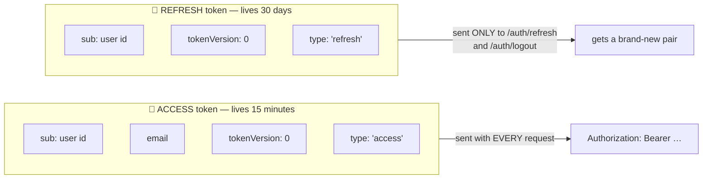

Three deliberate design choices, and the reason for each:

| Choice                             | Where                                                                          | Why                                                                                                                                                                                            |
| ---------------------------------- | ------------------------------------------------------------------------------ | ---------------------------------------------------------------------------------------------------------------------------------------------------------------------------------------------- |
| Access token expires in **15 min** | [auth.module.ts](../apps/api/src/auth/auth.module.ts)                          | If it leaks, it is useless within minutes.                                                                                                                                                     |
| Refresh token lasts **30 days**    | `REFRESH_TOKEN_TTL` in [auth.service.ts](../apps/api/src/auth/auth.service.ts) | So the user isn't asked to log in every 15 minutes.                                                                                                                                            |
| Both carry a **`type` claim**      | `issueTokens()`                                                                | A refresh token can never authorize a normal request (the JWT strategy rejects `type !== 'access'`), and an access token can never be refreshed. Same secret, two separate jobs, no confusion. |

There is also a **third, tiny token**: a 60-second `type: 'google_code'` used only for the mobile
Google handshake — see [§6.7](#67-google-sign-in-on-mobile-deep-link--one-time-code).

### 6.2 Email + password signup / login

Passwords are **never stored**. What's stored is a **bcrypt hash** — a one-way scramble with a
built-in random salt and a deliberate cost (10 rounds). You cannot reverse it; you can only hash a
guess and compare.

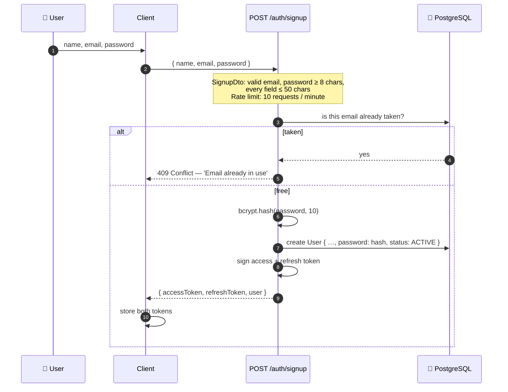

Login is the mirror image: find the user by email, `bcrypt.compare(typed, stored)`, and on success
issue the same token pair.

Two details worth knowing:

- **A wrong email and a wrong password give the identical error** — `401 "Invalid credentials"`.
  That's on purpose: a different message for each would let someone probe which emails are
  registered.
- **An account created through Google has `password = null`.** Trying to log in with a password
  hits the same generic `401`, because there is no password to compare against.

**Account status.** Every user has `status: PENDING | ACTIVE | SUSPENDED`. The code currently sets
new signups to `ACTIVE` explicitly, so there is **no manual approval step** — the comment in
`signup()` tells you exactly which line to comment out to bring the approval gate back.

### 6.3 Using the token on every request

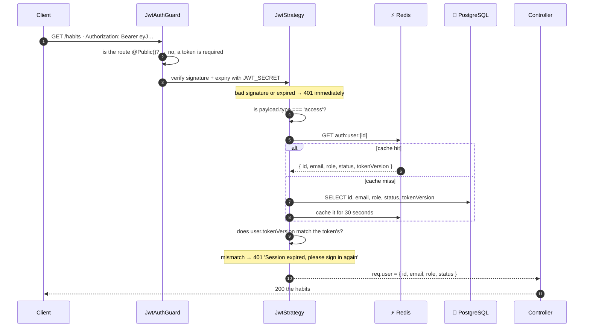

The important idea: **the token alone is not enough.** On every single request the API also loads
the _current_ user row and compares `tokenVersion`. That is what makes instant logout possible
([§6.5](#65-logout--instant-revocation-tokenversion)). The 30-second Redis cache keeps this from
becoming an extra database query per request, at the cost of a revocation being visible after at
most 30 seconds.

### 6.4 Silent refresh (why you never get logged out)

The access token dies every 15 minutes, yet the user never notices. Both clients wrap `fetch()` in
the same pattern: **on a 401, refresh once and replay the request.**

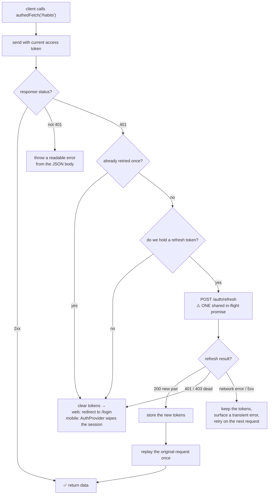

Two subtleties that are easy to get wrong and are handled here:

- **One refresh, not ten.** If six queries 401 at the same moment, `refreshInFlight` makes them all
  await _the same_ `/auth/refresh` call, then all retry with the new token. Without this you'd fire
  six refreshes, five of which would race.
- **Offline ≠ logged out.** A network failure during refresh keeps the tokens on disk. Only a
  definitive `401`/`403` from the server clears them. This is what lets the mobile app stay signed
  in on a plane.

Refresh is also **sliding**: each successful refresh returns a _new_ 30-day refresh token, so an
active user never has to sign in again.

> One place deliberately skips the cache: `AuthService.refresh()` reads `tokenVersion` **straight
> from PostgreSQL**. Minting a fresh 30-day token off a stale cached version is the one mistake the
> cache must never be able to make.

### 6.5 Logout & instant revocation (`tokenVersion`)

Here's the classic problem with stateless JWTs: **you can't un-sign a token.** Once issued, it is
valid until it expires. So how does "log out of all devices" work?

Answer: a counter on the user row, embedded into every token.

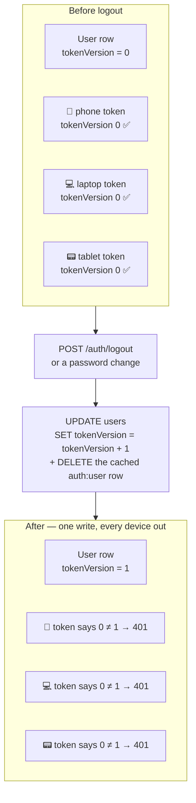

- Every access **and** refresh token embeds the `tokenVersion` it was minted with.
- Both `JwtStrategy.validate()` and `AuthService.refresh()` compare it to the row's current value.
- One `UPDATE` therefore kills every outstanding token for that user, everywhere, at once — no
  blocklist, no session table.
- The cached `auth:user:<id>` row is deleted in the same breath, so the change is effective on the
  next request rather than up to 30 seconds later.
- Changing your password bumps it too (see `updateProfile` in
  [users.service.ts](../apps/api/src/users/users.service.ts)) — exactly what you want after
  "I think someone knows my password".
- `logout()` is **idempotent** and always returns `{ success: true }`: an already-expired token has
  nothing left to revoke, and the client clears local tokens regardless.

### 6.6 Google sign-in on the web

The user never types a password into HabitFlow. Google vouches for them.

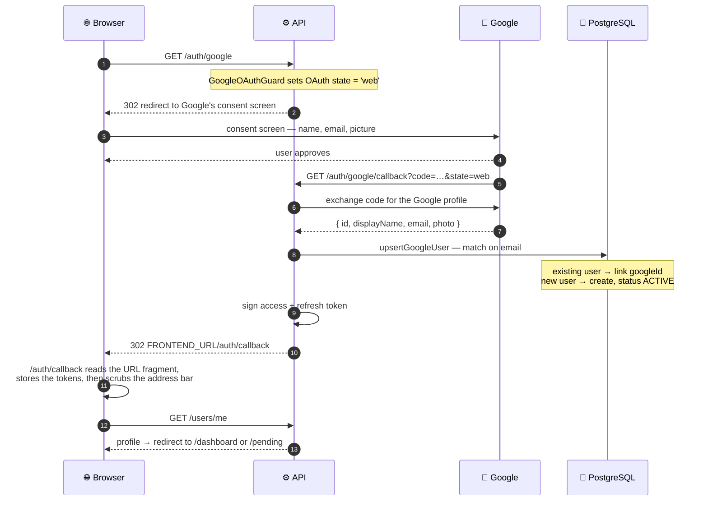

Three details that are there for a reason:

- **The tokens arrive in the URL `#fragment`, not the query string.** Fragments are never sent to
  the server and never land in proxy or access logs. The page immediately calls
  `history.replaceState` to wipe them from the address bar and browser history.
- **Accounts are matched by email.** Sign up with a password, later click "Continue with Google" on
  the same address, and `upsertGoogleUser` links `googleId` onto the existing row instead of
  creating a duplicate.
- **The Google routes carry `@SkipClientGuard()`.** Google's callback and a top-level browser
  navigation carry neither our custom header nor our Origin, so the app-client check has to step
  aside for exactly these two URLs.

### 6.7 Google sign-in on mobile (deep link + one-time code)

Mobile can't receive a browser redirect — it receives a **deep link** (`habitflow://…`). But a deep
link scheme can be claimed by _any_ installed app, so shipping real tokens through it would be
reckless. Instead the app receives a **60-second single-use code** and trades it for tokens over
HTTPS.

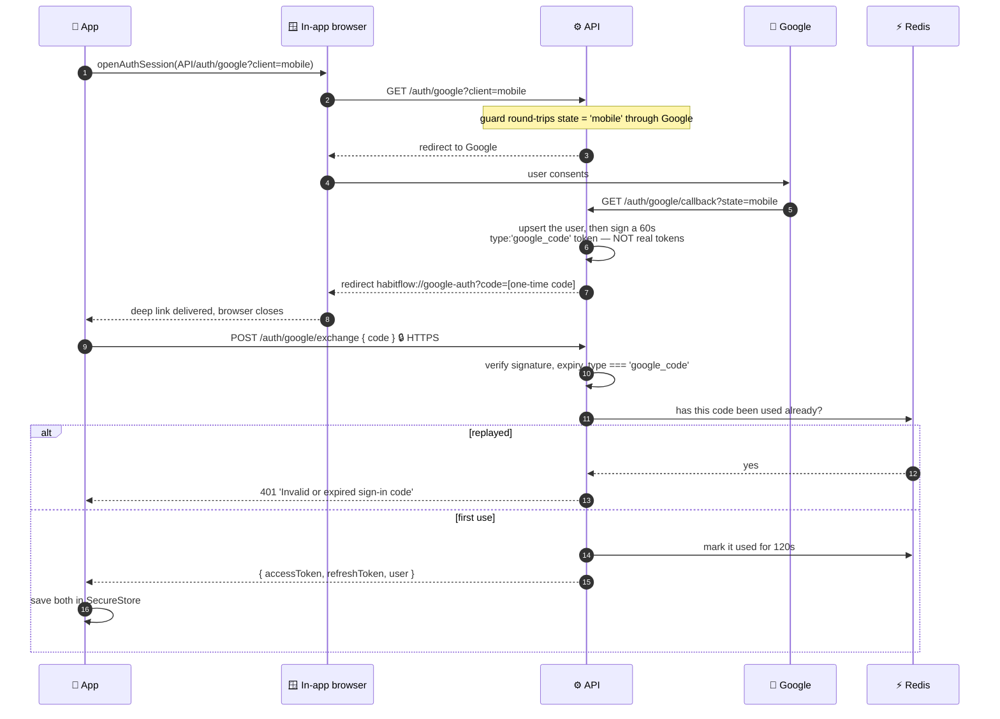

Defence in depth, three layers deep:

| Layer                              | Effect                                                                                                                               |
| ---------------------------------- | ------------------------------------------------------------------------------------------------------------------------------------ |
| The code is **not** a usable token | Even if another app intercepts the deep link, `JwtStrategy` rejects `type: 'google_code'`.                                           |
| **60-second expiry**               | The interception window is one minute wide.                                                                                          |
| **Redis replay marker**            | A second exchange of the same code fails outright. Marked "best-effort": with Redis down the 60-second expiry still bounds the risk. |

The app also guards its own side: `completeGoogleSignIn` keeps a `Map` of in-flight exchanges per
code, so React re-rendering the callback screen twice cannot double-spend the code.

### 6.8 Where tokens are stored, and why

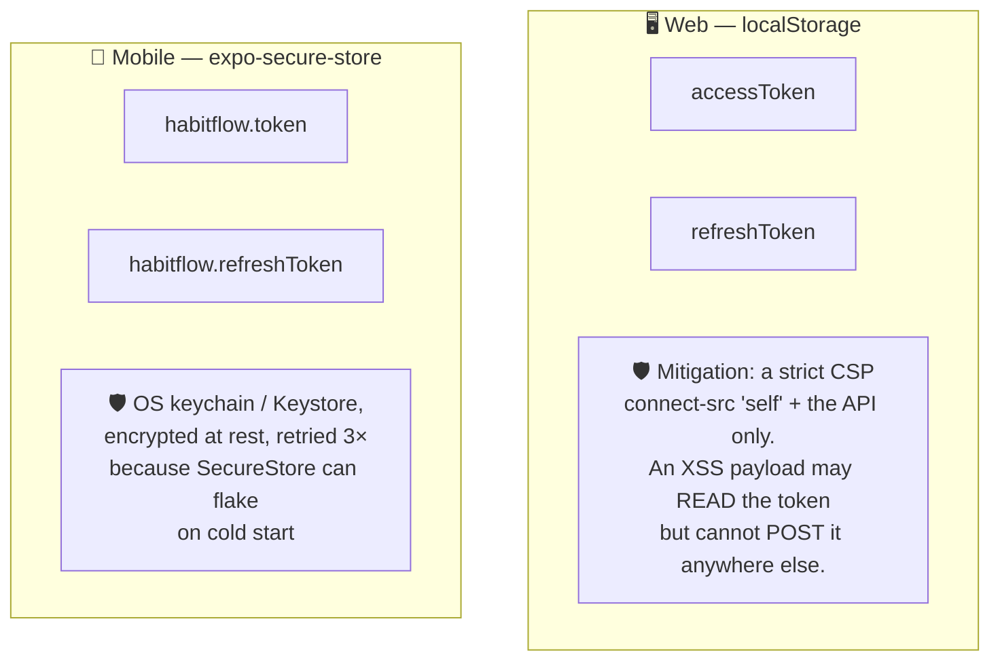

**Why not `httpOnly` cookies on the web?** They would be the stronger choice — but the web app and
the API live on _different sites_ (`…vercel.app` vs `…onrender.com`), and cross-site cookies are
unreliable-to-blocked in modern browsers. The trade-off is written up in
[next.config.js](../apps/web/next.config.js): tokens live in `localStorage`, and the load-bearing
defence becomes the CSP `connect-src` directive, which prevents an injected script from shipping a
stolen token to an attacker's host. `base-uri`, `object-src`, `form-action` and `img-src` close the
other common exfiltration channels.

---

## 7. 🚦 Authorization — the guard stack as a decision tree

Five guards are registered **globally** in [app.module.ts](../apps/api/src/app.module.ts), so they
run on every route in the whole API, in this exact order. The design principle is
**closed by default**: a new endpoint is protected the moment you write it, and opening it up takes
an explicit decorator.

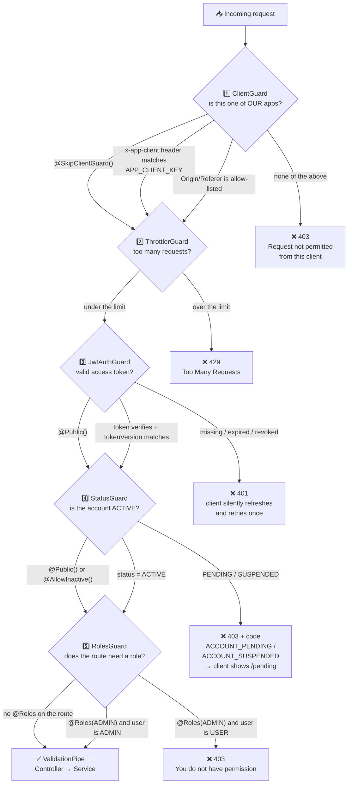

### What each guard is actually for

**1️⃣ ClientGuard** — [client.guard.ts](../apps/api/src/common/client.guard.ts)
Keeps casual Postman/curl/scraper traffic out. A request passes if it carries
`x-app-client: <APP_CLIENT_KEY>` (that's how the mobile app identifies itself) **or** comes from an
allow-listed browser Origin (that's the web app). The key is compared in **constant time** so its
value can't be guessed a character at a time by measuring response times.
The file is refreshingly honest about its own limits: a key shipped inside a public bundle can be
extracted, and an Origin header can be spoofed by a non-browser client. **This is a deterrent, not
a security boundary — the JWT is the real authorization.** And if `APP_CLIENT_KEY` isn't set, the
guard logs one warning and allows everything, so a half-configured deployment still works.

**2️⃣ ThrottlerGuard** — configured in [app.module.ts](../apps/api/src/app.module.ts)
Global default: **120 requests per minute** per client. The endpoints that are worth brute-forcing
tighten that to **10 per minute** with `@Throttle(...)`: `/auth/signup`, `/auth/login`,
`/auth/google/exchange`. `/health` opts out entirely with `@SkipThrottle()` so the keep-alive pinger
never eats the budget.

**3️⃣ JwtAuthGuard** — [jwt-auth.guard.ts](../apps/api/src/auth/jwt-auth.guard.ts)
Demands a valid access token unless the route (or its whole controller) is marked `@Public()`.
Very little is public: `/`, `/health`, everything under `/auth`, and `GET /app/version`.

**4️⃣ StatusGuard** — [status.guard.ts](../apps/api/src/auth/status.guard.ts)
Blocks accounts that aren't `ACTIVE`, and — importantly — returns a **machine-readable `code`**
alongside the message so clients can branch without parsing English. `@AllowInactive()` is the
opt-out, used on `GET /users/me` so a pending or suspended user can still load their own profile
and be shown the right waiting screen.

**5️⃣ RolesGuard** — [roles.guard.ts](../apps/api/src/auth/roles.guard.ts)
Routes with no `@Roles()` metadata are open to any role. `@Roles(Role.ADMIN)` on the
[AdminController](../apps/api/src/admin/admin.controller.ts) and
[AdminReleasesController](../apps/api/src/releases/releases.controller.ts) narrows _every_ route in
those classes to admins in one line.

### The decorators, gathered in one place

| Decorator                              | Defined in                                                                              | Effect                                     |
| -------------------------------------- | --------------------------------------------------------------------------------------- | ------------------------------------------ |
| `@Public()`                            | [public.decorator.ts](../apps/api/src/auth/public.decorator.ts)                         | No token needed.                           |
| `@AllowInactive()`                     | [allow-inactive.decorator.ts](../apps/api/src/auth/allow-inactive.decorator.ts)         | PENDING/SUSPENDED users may still call it. |
| `@Roles(Role.ADMIN)`                   | [roles.decorator.ts](../apps/api/src/auth/roles.decorator.ts)                           | Admins only.                               |
| `@SkipClientGuard()`                   | [skip-client-guard.decorator.ts](../apps/api/src/common/skip-client-guard.decorator.ts) | Skip the app-client check.                 |
| `@Throttle({...})` / `@SkipThrottle()` | `@nestjs/throttler`                                                                     | Per-route rate limits.                     |

### How someone becomes an admin

There is **no "make me admin" endpoint** — that would be the obvious way to lose the whole
dashboard. The first admin is promoted from a developer machine:

```sh
pnpm --filter api exec tsx scripts/promote-admin.ts you@example.com
```

See [promote-admin.ts](../apps/api/scripts/promote-admin.ts). It sets `role = ADMIN` and
`status = ACTIVE` and leaves an audit note. (Render's free tier has no shell, which is precisely why
this is a script you run against `DATABASE_URL` rather than an SSH command.)

---

## 8. The data model

Seven tables. Everything except `AppRelease` hangs off `User`.

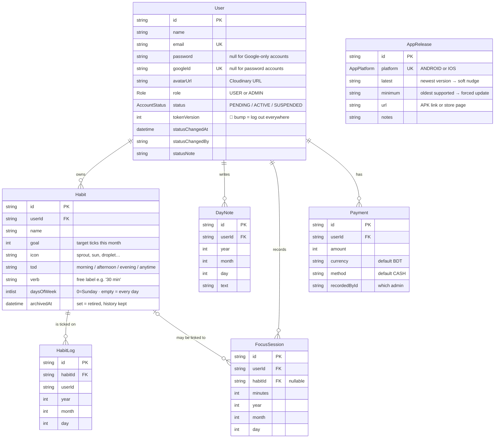

### The modelling decisions worth understanding

**Dates are stored as three integers, not a `DateTime`.**
`HabitLog`, `DayNote` and `FocusSession` all keep `year`, `month`, `day`. This looks odd until you
think about time zones: "did I meditate on the 3rd?" is a question about the _user's_ calendar. A
UTC timestamp would move that answer across a midnight boundary for anyone not on UTC. The client
sends its own local `year/month/day`, and the answer stays stable no matter where the user flies.

**`@@unique([habitId, year, month, day])` on `HabitLog`.**
The database itself guarantees one tick per habit per day. Two rapid taps, or an offline write
replayed twice, cannot create a duplicate — the constraint is the last line of defence behind the
idempotent `PUT /habits/logs`.

**`DayNote` is scoped to the day, not to a habit log.**
As the schema comment explains: the note that matters most is usually _"why did I miss this?"_ — and
a missed day has no `HabitLog` row to hang a note on. `@@unique([userId, year, month, day])` also
makes the client's `PUT` naturally idempotent.

**Archive ≠ delete.**
`archivedAt` takes a habit out of Today and out of the reminder schedule while keeping every log, so
past statistics stay honest. `DELETE` cascades the history away — a genuinely different action.

**`daysOfWeek: Int[] @default([])`.**
An empty list means "every day", which is exactly what every habit that predates the column already
meant. That's why the migration needed no data backfill.

**`FocusSession.habitId` is `onDelete: SetNull`.**
Delete a habit and the minutes you spent on it survive, just unlinked. Dedication outlives the
habit.

**Cascades:** deleting a `User` removes their habits, notes, sessions and payments. Deleting a
`Habit` removes its logs.

---

## 9. Caching with Redis

Redis is **entirely optional**. `REDIS_URL` unset → `RedisService` logs "caching disabled", every
`CacheService` method becomes a no-op, and every read goes to PostgreSQL. The app behaves
identically, just slower. `/health` reports the connection state.

There are two caching patterns in the codebase.

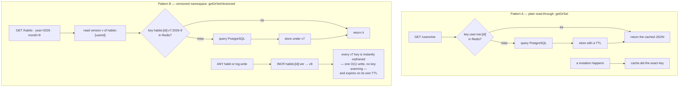

**Why Pattern B exists.** A user's habit data is cached _per month_. When they tick off a single
day, which months are now stale? Potentially several. Deleting them individually would mean scanning
keys — slow and awkward in Redis. Instead the cache key embeds a **version number**; bumping the
version with one `INCR` makes every key under that namespace unreachable at once. Orphans cost
nothing: they simply expire.

`version()` initialises a fresh namespace to the **current epoch-millis rather than 0**, so if a
version key is ever evicted while data keys survive, the new version can't collide with one already
in use.

| Cache key                | TTL    | Invalidated by                                      |
| ------------------------ | ------ | --------------------------------------------------- |
| `auth:user:<id>`         | 30 s   | logout, password change                             |
| `user:me:<id>`           | 5 min  | profile edit, avatar upload, admin status change    |
| `habits:<id>:v*`         | 10 min | any habit or log write (version bump)               |
| `daynotes:<id>:v*`       | 10 min | any note write (version bump)                       |
| `focus:<id>:v*`          | 10 min | recording a session (version bump)                  |
| `admin:stats`            | 30 s   | TTL only — it changes with every log write anywhere |
| `admin:users:v*`         | 60 s   | signup, status change, delete (version bump) + TTL  |
| `admin:payments:<id>`    | 5 min  | recording a payment                                 |
| `app:release:<platform>` | 10 min | an admin publishing a release                       |
| `auth:gcode:<code>`      | 120 s  | one-shot replay marker                              |

Every key is prefixed `ht:` so a shared Redis instance can be swept with one pattern. And the
client is built to **fail fast rather than hang**: `enableOfflineQueue: false` means a cache call
during an outage errors immediately instead of queueing — a cache miss costs one Postgres query, a
hung request costs the user. Warnings are throttled to one per 30 seconds so a prolonged outage
stays readable in the logs.

---

## 10. The web app

Next.js 16 **App Router** — each folder under `app/` is a URL — with React 19, Tailwind CSS v4,
TanStack Query for server state and Recharts for charts.

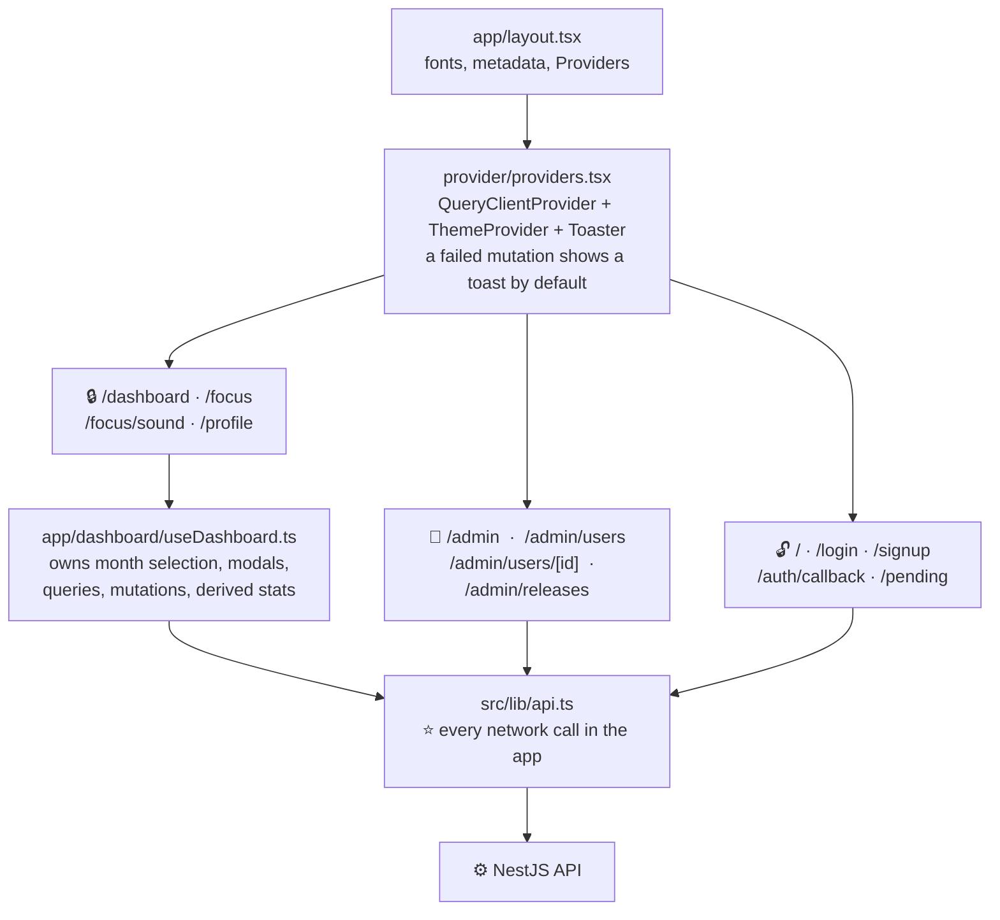

Patterns worth copying:

- **One API module.** [src/lib/api.ts](../apps/web/src/lib/api.ts) is the only file that calls
  `fetch`. Token storage, the client key header, silent refresh, error unwrapping and the
  401 → `/login` / 403 → `/pending` redirects all live there once.
- **Logic out of the markup.** [useDashboard.ts](../apps/web/app/dashboard/useDashboard.ts) holds
  everything the dashboard needs that isn't JSX; the page component reads from it and only renders.
- **Derive, don't store.** Streaks, completion rates and chart series are computed from the month's
  logs by [deriveStats.ts](../apps/web/src/lib/deriveStats.ts) —
  never persisted, so they can never drift out of sync with the logs.
- **Admin reuse.** `GET /admin/users/:id/habits` returns the _same shape_ as `GET /habits`, so the
  admin progress view renders any user's data through the unchanged dashboard components.
- **Security headers.** [next.config.js](../apps/web/next.config.js) sets a full CSP plus
  `nosniff`, `Referrer-Policy`, `X-Frame-Options: DENY` and a restrictive `Permissions-Policy`. The
  file also names the next hardening step honestly: per-request nonces via middleware, to drop
  `'unsafe-inline'` from `script-src`.

---

## 11. The mobile app (offline-first)

This is the most interesting engineering in the repo. **Every write works with no network**, and
nothing is lost.

Navigation is [expo-router](https://docs.expo.dev/router/introduction/) — file-based, like Next.js.
`src/app/(tabs)/` holds the four tabs (Today, Calendar, Stats, Settings); the rest are stacked
screens.

### The write path

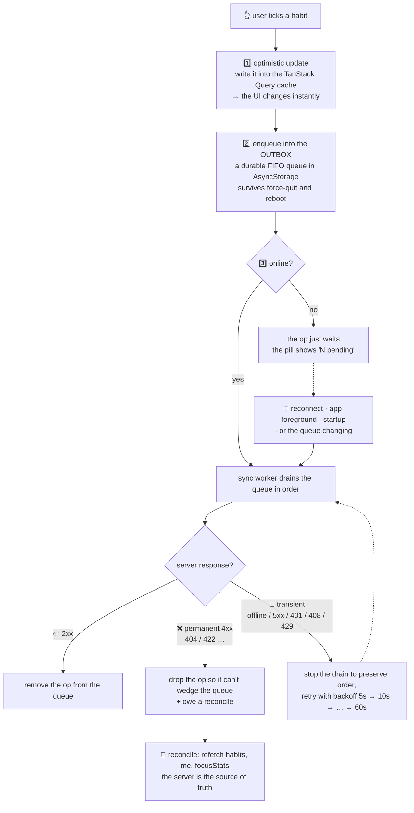

### Why every queued write is idempotent

Retrying is only safe if replaying an operation twice has the same effect as once. So each op kind
was designed for it:

| Op             | Endpoint               | What makes a replay safe                                                                                                                                      |
| -------------- | ---------------------- | ------------------------------------------------------------------------------------------------------------------------------------------------------------- |
| `habit.create` | `POST /habits`         | The **client generates the id**. The server checks for it first and returns the existing habit instead of creating a second one.                              |
| `log.set`      | `PUT /habits/logs`     | Sets an **absolute** state for the `(habit, date)` cell. `PUT`, not the `POST .../toggle` the web app uses — a replayed _toggle_ would flip the value back.   |
| `note.set`     | `PUT /notes`           | One note per day, and a **blank `text` clears it** (via `deleteMany`, so clearing an already-empty day is a no-op, not a 404). Absolute, so replay converges. |
| `focus.record` | `POST /focus/sessions` | Carries a client-generated id, deduplicated server-side.                                                                                                      |
| `habit.update` | `PATCH /habits/:id`    | Applying the same patch twice is a no-op.                                                                                                                     |
| `habit.delete` | `DELETE /habits/:id`   | Deleting an already-deleted habit is a definitive 404 → dropped as permanent.                                                                                 |

### Coalescing: keeping the queue small and consistent

[outbox.ts](../apps/mobile/src/offline/outbox.ts) folds redundant work as it's enqueued:

```
tick / untick / tick the same day  →  one log.set (the latest wins)
edit a habit twice                 →  one merged habit.update
edit a habit created offline       →  folded into the pending create
delete a habit created offline     →  create + delete cancel out entirely
```

There is one rule the whole file is organised around: **the op currently in flight is immutable.**
Its request body is already serialized and on the wire, so folding into it, mutating it, or
cancelling it would silently drop that write. `markInFlight(key)` pins it, and every coalescing
branch carries an `o.key === inFlightKey` escape hatch. Reads and writes go through a promise
`lock` so overlapping enqueues can't clobber each other across the AsyncStorage round-trip, and a
failed `persist()` **rolls back the in-memory queue** so RAM and disk never disagree.

### Why the sync gate is claimed synchronously

[sync.ts](../apps/mobile/src/offline/sync.ts) carries a comment that documents a real bug worth
remembering:

> A single write triggers `runSync` more than once in the same tick — the mutation's own call plus
> the outbox-change subscriber. With an async gap before the flag was set, each caller passed the
> check and dispatched the same head op — duplicate POSTs per click.

So `draining = true` is set **before the first `await`**, and late callers just queue one follow-up
pass (`drainQueued`). The same file is careful about _when_ to reconcile: after dropping a permanent
op or recovering from offline — **not** after every steady-state online write, because that would
fire a multi-month refetch per tick and could clobber a newer optimistic toggle mid-flight.

There's also an exhaustiveness guard (`assertNever`) at the end of `dispatch()`, added after a
newly-introduced op kind fell through silently, got counted as delivered, and lost the write.

### Extra state the mobile app keeps

| Where                         | What                                                              | Why                                                                                                                                                                                          |
| ----------------------------- | ----------------------------------------------------------------- | -------------------------------------------------------------------------------------------------------------------------------------------------------------------------------------------- |
| **SecureStore**               | access + refresh token, prefs, onboarding flag                    | Encrypted by the OS keychain/Keystore.                                                                                                                                                       |
| **AsyncStorage**              | the outbox, and the whole persisted query cache (1-week `maxAge`) | The app opens showing real data before any network call.                                                                                                                                     |
| **NetInfo → `onlineManager`** | online/offline                                                    | Drives the offline bar, the sync triggers, and query pausing.                                                                                                                                |
| **`networkMode: "always"`**   | mutation setting                                                  | The library default never calls `mutationFn` while offline — so ticking a habit did _nothing_: no optimistic update, nothing queued. This override is what makes offline writes work at all. |

**Sign-out wipes everything local**: tokens removed, sync worker reset, outbox cleared, query cache
cleared and the persister removed — so one user's pending writes can never replay under the next
account signed in on that device.

---

## 12. Reminders & forced updates

### Local reminders

Notifications are scheduled **on the device** by [expo-notifications](https://docs.expo.dev/versions/latest/sdk/notifications/) —
there is no push server, no device tokens, nothing to run. [reminders.ts](../apps/mobile/src/notifications/reminders.ts)
reads the current month's habits **out of the query cache**, filters out archived ones and anything
not due today (`daysOfWeek`), groups the rest by time-of-day slot, and lays down a rolling horizon
of local notifications.

`syncReminders()` re-runs on every app foreground, which tops up the horizon, prunes the past, and
re-evaluates completion and time-zone changes.

Each notification carries two action buttons:

- **Done** → writes the completion into the query cache _and_ enqueues a `log.set` op — the exact
  same offline path an in-app tap takes. Checking off a habit from the lock screen with no signal
  works.
- **Snooze** → reschedules the same habits 60 minutes later.

### The update gate

The mobile app is sideloaded (no store), so it checks for new versions itself.

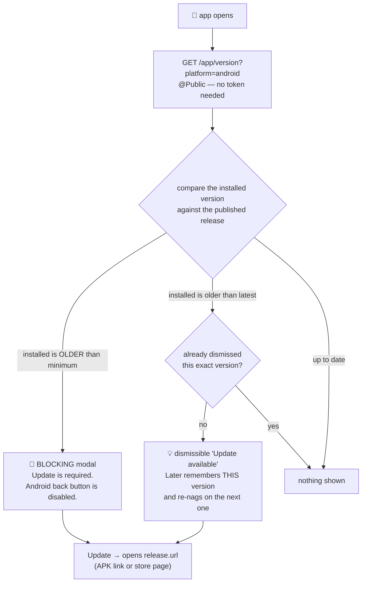

Admins publish releases at `PUT /admin/releases/:platform` from the web dashboard, setting `latest`
(soft nudge) and `minimum` (hard block — for when an old client would genuinely break against the
current API). `UpdateGate` renders **outside** the navigator so the prompt reaches the user on any
screen, auth screens included. See [releasing-the-mobile-app.md](releasing-the-mobile-app.md).

---

## 13. Error handling

One filter, [all-exceptions.filter.ts](../apps/api/src/common/all-exceptions.filter.ts), catches
_everything_ and returns one consistent envelope:

```json
{
    "statusCode": 403,
    "error": "Forbidden",
    "message": "Your account has been suspended.",
    "code": "ACCOUNT_SUSPENDED"
}
```

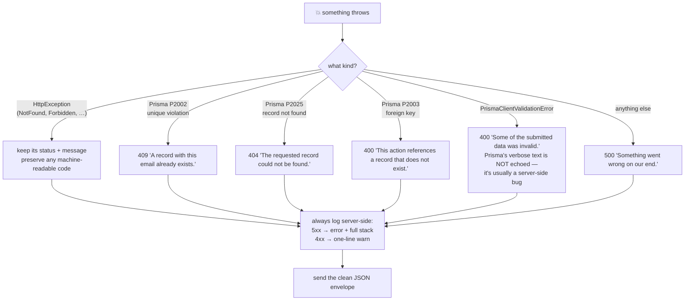

Two principles: **the client gets a sentence a human can read, and never an internal detail**; and
**anything unexpected is a 500 with a full stack in the server log**, not a leaked message.

The `code` field is what makes the client redirects in [§6.3](#63-using-the-token-on-every-request)
and [§7](#7--authorization--the-guard-stack-as-a-decision-tree) possible without string-matching
English text.

---

## 14. Complete API reference

`🔓` = no token · `🔒` = any signed-in ACTIVE user · `👑` = ADMIN only

### Health

|     | Endpoint      | Notes                                                                                                                           |
| --- | ------------- | ------------------------------------------------------------------------------------------------------------------------------- |
| 🔓  | `GET /`       | Hello.                                                                                                                          |
| 🔓  | `GET /health` | `{ status, uptime, timestamp, redis }`. Render's health check and the keep-alive target. Skips throttling and the client guard. |

### Auth — [auth.controller.ts](../apps/api/src/auth/auth.controller.ts)

|     | Endpoint                     | Notes                                                                       |
| --- | ---------------------------- | --------------------------------------------------------------------------- |
| 🔓  | `POST /auth/signup`          | `{ name, email, password }` → tokens + user. 10/min.                        |
| 🔓  | `POST /auth/login`           | `{ email, password }` → tokens + user. 10/min.                              |
| 🔓  | `POST /auth/refresh`         | `{ refreshToken }` → a **new pair** (sliding expiry).                       |
| 🔓  | `POST /auth/logout`          | `{ refreshToken }` → bumps `tokenVersion`; kills every session. Idempotent. |
| 🔓  | `GET /auth/google`           | Redirects to Google. `?client=mobile` switches to the deep-link flow.       |
| 🔓  | `GET /auth/google/callback`  | Google returns here; redirects to the web app or the app deep link.         |
| 🔓  | `POST /auth/google/exchange` | `{ code }` → tokens + user. Mobile only. 10/min.                            |

### Habits — [habits.controller.ts](../apps/api/src/habits/habits.controller.ts)

|     | Endpoint                      | Notes                                                                                                 |
| --- | ----------------------------- | ----------------------------------------------------------------------------------------------------- |
| 🔒  | `GET /habits?year&month`      | Habits with that month's logs. Defaults to the current month.                                         |
| 🔒  | `POST /habits`                | Create. Accepts a client-supplied `id` → idempotent.                                                  |
| 🔒  | `PATCH /habits/:id`           | Edit; also archive/restore.                                                                           |
| 🔒  | `DELETE /habits/:id`          | Delete, cascading the logs.                                                                           |
| 🔒  | `POST /habits/apply-template` | Bulk-create from a built-in template: `morning-routine`, `fitness`, `study`, `health`, `mindfulness`. |
| 🔒  | `POST /habits/logs/toggle`    | Flip a day. Used by the **web**.                                                                      |
| 🔒  | `PUT /habits/logs`            | Set a day absolutely. Used by **mobile offline sync**.                                                |

### Notes · Focus · Users

|      | Endpoint                          | Notes                                                                                                                                                                                                      |
| ---- | --------------------------------- | ---------------------------------------------------------------------------------------------------------------------------------------------------------------------------------------------------------- |
| 🔒   | `GET /notes?year&month`           | One month of day notes.                                                                                                                                                                                    |
| 🔒   | `PUT /notes`                      | Set one day's note; a blank `text` clears it. No `DELETE` needed — the write is absolute and idempotent.                                                                                                   |
| 🔒   | `POST /focus/sessions`            | Record finished minutes (1–240), optionally linked to a habit. Accepts a client-supplied `id` → idempotent. If the habit was deleted meanwhile, the session is recorded **unlinked** rather than rejected. |
| 🔒   | `GET /focus/stats?year&month&day` | Today / week / all-time totals, streak, best day, per-habit breakdown. The date is the **client's** local today.                                                                                           |
| 🔒\* | `GET /users/me`                   | _`@AllowInactive` — works while PENDING/SUSPENDED, which is how the clients decide to show `/pending`._                                                                                                    |
| 🔒   | `PATCH /users/me`                 | Change name and/or password. A password change requires the current one and bumps `tokenVersion`.                                                                                                          |
| 🔒   | `POST /users/me/avatar`           | `multipart/form-data`, field `avatar`. Images only, ≤ 5 MB, uploaded to Cloudinary and cropped to a 200×200 face-gravity square.                                                                           |

### Admin — [admin.controller.ts](../apps/api/src/admin/admin.controller.ts) · [releases.controller.ts](../apps/api/src/releases/releases.controller.ts)

|     | Endpoint                                                | Notes                                                                   |
| --- | ------------------------------------------------------- | ----------------------------------------------------------------------- |
| 👑  | `GET /admin/stats`                                      | Totals, users by status, logs today, active users today, 7-day signups. |
| 👑  | `GET /admin/users?status&search&page&pageSize`          | Paginated, `pageSize` clamped to 100.                                   |
| 👑  | `GET /admin/users/:id`                                  | Detail + payment history.                                               |
| 👑  | `GET /admin/users/:id/habits?year&month`                | Same shape as `GET /habits`.                                            |
| 👑  | `PATCH /admin/users/:id/status`                         | ACTIVE / PENDING / SUSPENDED, with an audit note.                       |
| 👑  | `DELETE /admin/users/:id`                               | Cascades all their data.                                                |
| 👑  | `POST /admin/users/:id/payments` · `GET …/payments`     | Record and list manual payments.                                        |
| 🔓  | `GET /app/version?platform=android\|ios`                | What the update gate polls.                                             |
| 👑  | `GET /admin/releases` · `PUT /admin/releases/:platform` | List and publish releases.                                              |

---

## 15. Running it locally

**You need:** Node.js 22+, pnpm 9, PostgreSQL. Redis is optional.

```sh
# 1 — install the workspace (api + web + packages)
pnpm install

# 2 — copy the env templates and fill them in
cp apps/api/.env.example    apps/api/.env
cp apps/web/.env.example    apps/web/.env
cp apps/mobile/.env.example apps/mobile/.env

# 3 — create the database tables
pnpm migrate            # = prisma migrate dev

# 4 — run the API + web app together
pnpm dev
```

Then, in a second terminal, the mobile app (remember: **npm**, not pnpm — it's outside the
workspace):

```sh
cd apps/mobile
npm install
npx expo start
```

### ⚠️ The port: **4000**, and always set the client URL explicitly

There is a stale number floating around the repo, and it will cost you an afternoon if you don't
know about it:

| Place                                                                                                                                                                                       | Says                                 |
| ------------------------------------------------------------------------------------------------------------------------------------------------------------------------------------------- | ------------------------------------ |
| [main.ts](../apps/api/src/main.ts) — the actual server                                                                                                                                      | `process.env.PORT ?? 4000`           |
| `apps/api/.env` (working local setup)                                                                                                                                                       | `PORT=4000`                          |
| The hard-coded fallbacks in [web/src/lib/api.ts](../apps/web/src/lib/api.ts), [mobile/src/api/client.ts](../apps/mobile/src/api/client.ts) and [next.config.js](../apps/web/next.config.js) | `http://localhost:3333` ⬅️ **stale** |
| The root [README.md](../README.md)                                                                                                                                                          | "port `3333`" ⬅️ **stale**           |

**So: the API runs on 4000, and the client fallbacks point at 3333.** They only agree because the
env files override the fallback. Never rely on the fallback — set the URL explicitly:

```sh
# apps/web/.env
NEXT_PUBLIC_API_URL=http://localhost:4000

# apps/mobile/.env  — a REAL device cannot reach "localhost"; use your machine's LAN IP
EXPO_PUBLIC_API_URL=http://192.168.1.5:4000
```

### The environment variables that matter

| Variable                                         | Where  | What happens without it                                                                                                                                                                               |
| ------------------------------------------------ | ------ | ----------------------------------------------------------------------------------------------------------------------------------------------------------------------------------------------------- |
| `DATABASE_URL`                                   | api    | Nothing works. Required.                                                                                                                                                                              |
| `JWT_SECRET`                                     | api    | Tokens can't be signed. Required.                                                                                                                                                                     |
| `PORT`                                           | api    | Falls back to **4000**. See the warning above.                                                                                                                                                        |
| `REDIS_URL`                                      | api    | Caching silently disabled; everything still works.                                                                                                                                                    |
| `FRONTEND_URL` / `CORS_ORIGINS`                  | api    | The browser blocks the web app on CORS. Comma-separated allow-list.                                                                                                                                   |
| `APP_CLIENT_KEY`                                 | api    | ClientGuard logs one warning and lets everything through. **Must be byte-identical** to the web's `NEXT_PUBLIC_APP_CLIENT_KEY` and the mobile's `EXPO_PUBLIC_APP_CLIENT_KEY`, or every request 403s.  |
| `GOOGLE_CLIENT_ID` / `_SECRET` / `_CALLBACK_URL` | api    | Google sign-in is skipped entirely — `AuthModule` only constructs `GoogleStrategy` when a client id exists, because the library throws at construction with an empty one. Email/password still works. |
| `MOBILE_GOOGLE_REDIRECT`                         | api    | Defaults to `habitflow://google-auth`. Must match `scheme` in [app.json](../apps/mobile/app.json).                                                                                                    |
| `CLOUDINARY_*`                                   | api    | Avatar upload fails; nothing else does.                                                                                                                                                               |
| `NEXT_PUBLIC_API_URL`                            | web    | **Set it.** The code fallback is a stale `http://localhost:3333`. Also feeds the CSP `connect-src`, so an unset/wrong value silently blocks every API call.                                           |
| `EXPO_PUBLIC_API_URL`                            | mobile | **Set it.** The stale fallbacks are `10.0.2.2:3333` on Android emulators and `localhost:3333` elsewhere. **A real device needs your machine's LAN IP** — `localhost` there means the phone itself.    |

> **A note on `NEXT_PUBLIC_` / `EXPO_PUBLIC_` prefixes:** these are compiled _into the bundle_ and
> are readable by anyone. Never put a real secret behind one. `APP_CLIENT_KEY` is deliberately not
> treated as a secret — see [§7](#7--authorization--the-guard-stack-as-a-decision-tree).

### Root scripts

| Command                                         | Does                                                                   |
| ----------------------------------------------- | ---------------------------------------------------------------------- |
| `pnpm dev`                                      | All apps in dev (`--filter=web` to narrow).                            |
| `pnpm build` · `pnpm lint` · `pnpm check-types` | Across the whole workspace, via Turborepo.                             |
| `pnpm format`                                   | Prettier over every `.ts/.tsx/.md`.                                    |
| `pnpm migrate`                                  | `prisma migrate dev` — create + apply a migration locally.             |
| `pnpm migrate:deploy`                           | `prisma migrate deploy` — apply existing migrations (production-safe). |
| `pnpm migrate:status`                           | What's pending.                                                        |

> After changing `schema.prisma`, run `pnpm --filter api exec prisma generate`. The client is
> generated into the **gitignored** `apps/api/generated/prisma`, which is why CI has an explicit
> generate step — without it, every Prisma type resolves to `error`.

---

## 16. Deployment & CI

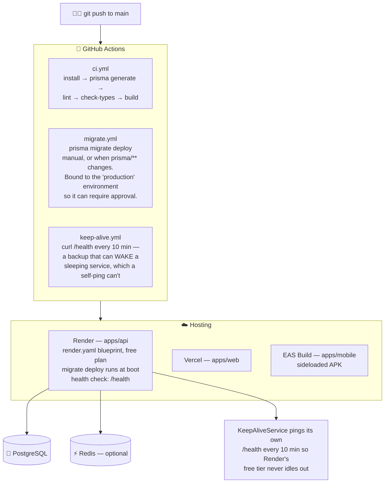

Things to know before you touch deployment:

- **Migrations run at boot**, in `startCommand`, because Render's free plan has no
  `preDeployCommand`. Prisma is invoked through its `.bin` path so the runtime never needs pnpm.
- **`--prod=false` in `buildCommand`** forces devDependencies (the Nest CLI, the Prisma CLI,
  TypeScript) to install even though Render sets `NODE_ENV=production`.
- **`NODE_VERSION` is pinned to 22.x.** The root `engines: ">=18"` would otherwise resolve to the
  newest Node, and Node 25+ no longer bundles corepack — which the build command uses.
- **`APP_CLIENT_KEY` uses `sync: false`, not `generateValue`.** Both sides must know the same value,
  so it can't be auto-generated.
- **Two keep-alive mechanisms, on purpose.** The in-process
  [KeepAliveService](../apps/api/src/common/keep-alive.service.ts) prevents the service from going
  idle; the GitHub Action can _wake_ one that already slept (e.g. after a crash), which a self-ping
  by definition cannot. GitHub cron is best-effort and gets disabled after 60 days of repo
  inactivity — hence backup, not primary.
- **The root `Dockerfile` is a dev-mode convenience** (`pnpm run dev`), not the production image.
  Production is the Render blueprint.

---

## 17. Cheat sheet: "where do I change X?"

| I want to…                        | Go to                                                                                                                                                                                                                                        |
| --------------------------------- | -------------------------------------------------------------------------------------------------------------------------------------------------------------------------------------------------------------------------------------------- |
| Add a field to a habit            | [schema.prisma](../apps/api/prisma/schema.prisma) → `pnpm migrate` → the DTOs in `apps/api/src/habits/dto/` → both clients' types                                                                                                            |
| Add an API endpoint               | the module's `*.controller.ts` + `*.service.ts`, and a DTO if it takes a body                                                                                                                                                                |
| Make an endpoint public           | `@Public()` from [public.decorator.ts](../apps/api/src/auth/public.decorator.ts)                                                                                                                                                             |
| Make an endpoint admin-only       | `@Roles(Role.ADMIN)`                                                                                                                                                                                                                         |
| Change token lifetimes            | `signOptions` in [auth.module.ts](../apps/api/src/auth/auth.module.ts) (access) · `REFRESH_TOKEN_TTL` in [auth.service.ts](../apps/api/src/auth/auth.service.ts) (refresh)                                                                   |
| Change rate limits                | `ThrottlerModule.forRoot` in [app.module.ts](../apps/api/src/app.module.ts), or a per-route `@Throttle`                                                                                                                                      |
| Re-enable manual account approval | comment out the `status: 'ACTIVE'` lines in `signup()` and `upsertGoogleUser()` in [auth.service.ts](../apps/api/src/auth/auth.service.ts)                                                                                                   |
| Add a cached read                 | `cache.getOrSet` or `getOrSetVersioned`, plus a key + TTL in [cache-keys.ts](../apps/api/src/redis/cache-keys.ts)                                                                                                                            |
| Allow a new frontend origin       | `CORS_ORIGINS` (and the dev pattern in [allowed-origins.ts](../apps/api/src/common/allowed-origins.ts))                                                                                                                                      |
| Add a web page                    | a folder under [apps/web/app/](../apps/web/app/) with a `page.tsx`                                                                                                                                                                           |
| Add a mobile screen               | a file under [apps/mobile/src/app/](../apps/mobile/src/app/) (expo-router)                                                                                                                                                                   |
| Add a new offline-capable write   | a new op kind in [outbox.ts](../apps/mobile/src/offline/outbox.ts) **and** a case in `dispatch()` in [sync.ts](../apps/mobile/src/offline/sync.ts) — the `assertNever` guard exists because forgetting the second half silently loses writes |
| Change a habit template           | `TEMPLATES` at the top of [habits.service.ts](../apps/api/src/habits/habits.service.ts)                                                                                                                                                      |
| Promote an admin                  | `pnpm --filter api exec tsx scripts/promote-admin.ts you@example.com`                                                                                                                                                                        |
| Publish a mobile update           | the `/admin/releases` page → see [releasing-the-mobile-app.md](releasing-the-mobile-app.md)                                                                                                                                                  |
| Adjust security headers / CSP     | [next.config.js](../apps/web/next.config.js)                                                                                                                                                                                                 |

---

## 18. Other docs in this folder

| Doc                                                          | What's in it                                                                                                                                                      |
| ------------------------------------------------------------ | ----------------------------------------------------------------------------------------------------------------------------------------------------------------- |
| [admin-access-control-plan.md](admin-access-control-plan.md) | The original design plan for roles, the approval gate and the admin dashboard — the reasoning behind [§7](#7--authorization--the-guard-stack-as-a-decision-tree). |
| [mobile-audit-and-roadmap.md](mobile-audit-and-roadmap.md)   | A feature audit of the mobile app with a prioritised improvement roadmap.                                                                                         |
| [features-or-bugDoc.md](features-or-bugDoc.md)               | The living feature / bug to-do list.                                                                                                                              |
| [releasing-the-mobile-app.md](releasing-the-mobile-app.md)   | How a new APK reaches people who already have the app installed.                                                                                                  |

---

<p align="center"><em>Diagrams are <a href="https://mermaid.js.org">Mermaid</a> — they render natively on GitHub.<br/>
In VS Code, install the "Markdown Preview Mermaid Support" extension to see them in the preview pane.</em></p>
